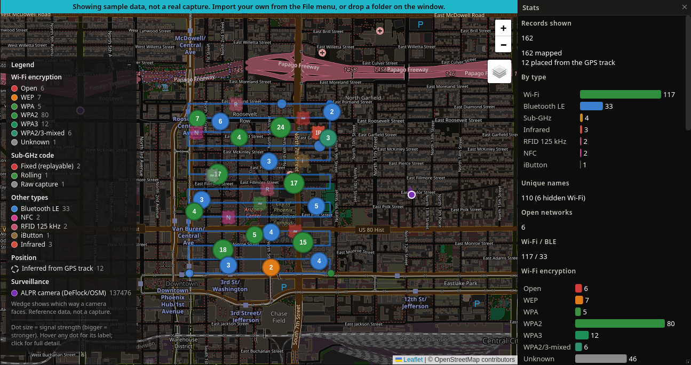
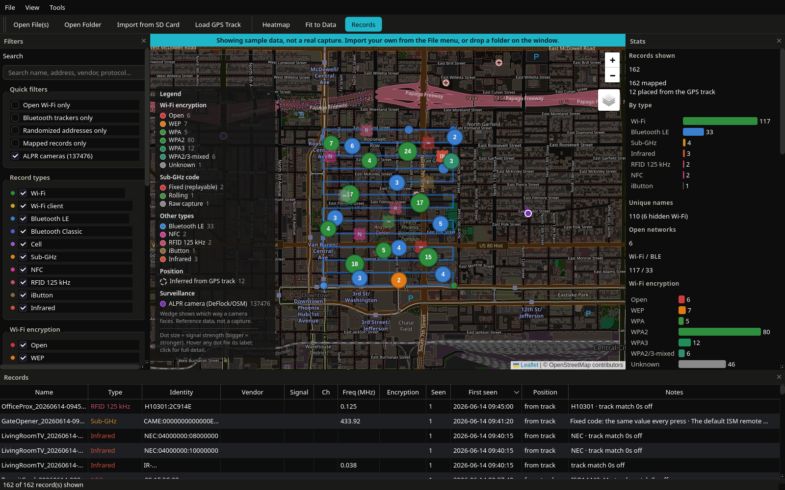
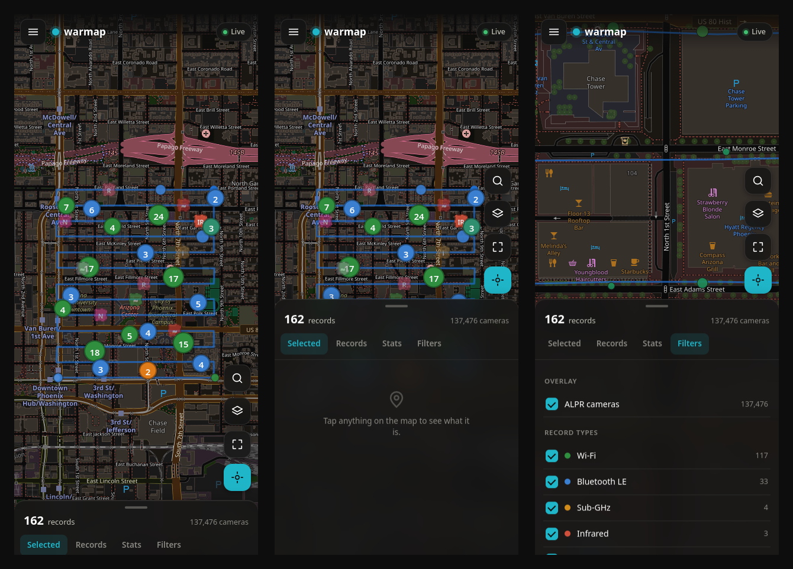

# warmap

[](https://github.com/munzzyy/warmap/actions/workflows/ci.yml)
[](LICENSE)
[](pyproject.toml)
[](#install)

**A native map for wardriving and Flipper Zero captures. Offline, on your
machine, no account.**

Point it at a folder of captures and it plots the lot on a real map: wardrive
CSVs off an ESP32 Marauder or the WiGLE app, Bluetooth advertisements,
packet captures, and every kind of file a Flipper Zero saves (Sub-GHz, NFC,
125 kHz RFID, iButton and infrared). Clustered, colored by what matters for
each technology, with a heatmap, a filter panel, a sortable records table
and a stats panel. Import is additive, so the map keeps growing every time
you go out with the board.



Three things it does that the other tools don't. A Flipper file has no
coordinates, but a Marauder wardrive from the same walk is a GPS log, so
warmap places each `.sub` or `.nfc` by its timestamp against that track,
with nothing extra to carry ([how placement works](#placing-flipper-captures-on-the-map)).
It overlays about 137,000 license-plate readers compiled by DeFlock from
OpenStreetMap, each with a wedge for the way it faces, and counts the ones
within 500 m of your route ([the camera overlay](#flock--alpr-cameras)). And
it hands the same map to your phone from a QR code over your own Wi-Fi, or
as one HTML file that works with the PC off ([on your phone](#on-your-phone)).

If you already use WiGLE or Kismet: WiGLE is upload-then-browse on someone
else's server, and Kismet is live capture with its own web UI and no idea
what a Flipper file is. warmap is offline post-processing of files you
already have, with the Flipper, pcap and tracker side that neither covers.
The only network traffic it makes on its own is map tiles, and those are
cached; the two refresh commands fetch only when you run them.

Contents: [Install](#install) · [Getting data onto it](#getting-data-onto-it) ·
[Placing Flipper captures](#placing-flipper-captures-on-the-map) ·
[What it shows](#what-it-shows) · [Trackers](#trackers-and-things-that-travelled-with-you) ·
[Cameras](#flock--alpr-cameras) · [Phone](#on-your-phone) · [Privacy](#privacy) ·
[CLI](#cli) · [Tests](#tests) · [Limitations](#limitations-honestly) · [Roadmap](#roadmap)

## Install

With Python 3.10 or newer:

```bash
pipx install git+https://github.com/munzzyy/warmap
warmap
```

The window opens on a bundled sample session, so that is a one-minute look
at everything below. `pip install git+https://github.com/munzzyy/warmap`
works too. The one dependency is PySide6, which brings Qt WebEngine for the
map (a 150 MB download the first time). Node is only needed to run one test
module.

Without Python: each [release](https://github.com/munzzyy/warmap/releases)
carries a build for Linux (x86_64, glibc 2.35 or newer), Windows (x64) and
macOS (Apple Silicon and Intel, as separate zips). Unpack it and run `warmap`; on Windows double-click
`warmap.exe`, and use `warmap-cli.exe` in the same folder for the terminal
commands. The macOS app is not signed, so the first launch is right-click,
Open, and on recent versions a trip to System Settings, Privacy and
Security, Open Anyway. Other Linux architectures use the pipx line above.

From a checkout, `pip install -e .` gives you the same `warmap` command, and
`bin/warmap` runs it without installing anything if PySide6 is already on
your system. On Linux, `bash install.sh` adds an app-menu entry and an icon.

I use it on Linux. On macOS and Windows the data lives in the platform's own
app folder, the SD-card import looks under `/Volumes` or at removable drive
letters, the release workflow builds and starts the bundle on all three, and
CI runs the whole suite on all three. `warmap doctor` prints what your
install is and where its data lives, and `warmap doctor --map` starts the
map engine to prove it works. If something is off on yours,
[tell me](https://github.com/munzzyy/warmap/issues).

First run loads a bundled sample session: a wardrive CSV, the GPS track
recorded alongside it, and a folder of Flipper captures, with a banner saying
so. The sample includes captures that only appear because the track placed
them, so the mechanism is on screen before you've imported anything.
Import anything real and the sample goes for good. It never mixes with your
data and is never written to the store.

## Getting data onto it

Pull the SD card, plug it in, and use File > Import from SD Card. It scans
the removable media on your machine and offers everything it finds. Open
File(s), Open Folder and dragging a folder onto the window all do the same
job. Point it at the root of a Flipper card and it walks `subghz/`, `nfc/`,
`lfrfid/`, `ibutton/` and `infrared/` on its own.

All of it is additive. Load five drives from five days and warmap merges
them, collapsing repeat sightings of the same thing by keeping the strongest
signal and counting how many times it saw that device in total.

### What it reads

| | |
|---|---|
| Wardrive CSV | `WigleWifi-1.4` (what Marauder writes) and `1.6` (what the WiGLE app writes), plus Kismet and generic lat/lon exports |
| Flipper captures | `.sub` `.nfc` `.rfid` `.ibtn` `.ir` `.picopass` |
| Packet captures | `.pcap` and `.pcapng`: 802.11 beacons, probe requests and Bluetooth LE advertisements |
| GPS tracks | `.nmea`, `.gpx`, and `.log` or `.txt` files holding NMEA |

`warmap formats` prints the current list, including which link-layer types
the pcap reader handles.

A wardrive isn't always a `.csv`. The Flipper Marauder companion app saves to
`apps_data/marauder/dumps/wardrive_0.txt` and a standalone Marauder writes
`wardrive_0.log`, so warmap identifies those by content rather than
extension. Filtering on the extension would miss most captures.

It also reads the raw Marauder serial stream, which is messier than the
companion app's cleaned-up file: Wi-Fi rows carry a console counter and BLE
rows have the device's advertised name jammed onto the front of the MAC.
warmap untangles both and pulls that BLE name into the map, so a capture
taken by the one-button `Wardrive-AllInOne.js` script in this repo's
[`flipper-app/`](flipper-app/) carries device names the companion app throws
away.

## Placing Flipper captures on the map

On stock firmware, Flipper files contain no coordinates and no timestamp. A
`.sub` knows its frequency and its key, not where you were standing. So
warmap places them by matching each file's timestamp against a GPS track
from the same session.

You almost certainly already have that track. Nothing on a Flipper writes a
GPS log (the `gps_nmea` app shows a position on screen and never saves it),
so on paper you'd need a separate logger just to map an NFC read. But a
Marauder wardrive is a GPS log: every row carries the latitude, longitude and
time it was recorded at. Run a wardrive while you walk around with the
Flipper and warmap rebuilds a track from the CSV and places everything
against it, with no extra equipment and nothing to configure.

If you'd rather have a proper track, since denser points mean tighter
placement, load a `.nmea` or `.gpx` alongside the captures and that gets
used instead. Any phone GPS-logger app that exports GPX will do; GPSLogger
on Android (on F-Droid) and Open GPX Tracker on iOS are two free ones. A
rebuilt track draws dashed on the map, because its points only exist where
the wardrive happened to see something.

A position worked out that way is an inference, not a measurement, and
warmap never pretends otherwise. Those markers are drawn dashed and
half-transparent, the popup says where the coordinate came from, the records
table has a Position column reading "GPS fix" or "from track", and the stats
panel counts them separately.

That carries into the exports. CSV, GeoJSON and KML all record which it was.
GPX has no field for it, so it goes in the waypoint description. WiGLE CSV
leaves inferred positions out entirely: that format exists to be uploaded and
traded between tools, it has no provenance column, and a guessed coordinate
submitted as a measured one is bad data in someone else's database as well as
your own.

Two things to know. Copying with plain `cp` destroys the timestamps: it
rewrites every mtime to the moment of the copy, and after that nothing
places. Use `cp -p` or `rsync -a`. warmap detects the signature of this (a
pile of files all modified seconds ago) and tells you rather than dropping
everything on one spot.

Momentum, RogueMaster and Xtreme are different. Those forks tag `.sub` saves
with `Lat:` and `Lon:` from an attached GPS module (Xtreme misspells it
`Latitute:`), and weather-station and TPMS captures also carry a real `Ts:`
timestamp from the Flipper's clock. warmap reads all of that and treats it as
a real fix. If no GPS module was attached the coordinates read `0.000000`,
which means "no fix", not a point in the Gulf of Guinea.

If captures aren't landing, Tools > GPS placement settings widens the match
tolerance and corrects for a Flipper whose clock was wrong.

## What it shows

<p align="center">
  
</p>

Wi-Fi is colored by encryption: red for open, orange for WEP, green for any
WPA flavor, gray for unclassifiable. Sub-GHz is colored by something more
useful, whether the code is fixed or rolling. A fixed code is the same on
every press, so a capture of one replays; a rolling code changes each press
and a recorded one is normally spent. Those are not the same finding and the
map doesn't draw them the same. Everything else is colored by type, and the
Flipper types get a glyph marker, so an NFC card and an iButton look
different at a glance.

Packet captures add Wi-Fi clients, which a wardrive CSV never has. A probe
request is a device asking for a network by name, so a capture from
Marauder's probe-sniffing mode maps the phones and laptops that went past and
the networks they remember being on. They get their own record type, because
a device asking for a network and a device offering one are not the same
thing.

Each record type is its own map layer, toggleable from the control in the
corner. The GPS track draws as a line with its start and end marked.

The popup is type-aware. A Sub-GHz record shows its protocol, key, code type,
band, what that band is normally used for, and the modulation. A Bluetooth
record shows the vendor, the company ID, advertised services, whether the
address is randomized, and whether it matches a known consumer tracker,
distinguishing a match on the actual advertisement structure from a match on
nothing more than the device's claimed name.

The records table along the bottom lists everything currently visible,
sortable by any column. It's also the only place records with no location
show up at all, which matters because a capture that couldn't be matched to
a track is still a real capture.

The filter panel narrows what's plotted. There is free-text search across
names, addresses, vendors and decoded fields, checkboxes for type,
encryption, band and channel, a minimum-signal slider and a minimum-times-seen
spinner. Quick toggles cover open networks, Bluetooth trackers, randomized
addresses and mapped-only.

The stats panel always reflects the filtered set: counts by type, band and
Sub-GHz code type, the encryption breakdown, tracker and randomized-address
counts, top vendors, channel distribution, time range, GPS track distance,
and the bounding box.

Export the filtered view to CSV, GeoJSON, GPX, KML or WiGLE CSV.

## Trackers, and things that travelled with you

A BLE sniff from the Marauder, dropped in the same folder as the wardrive
from the same run, lands on the map at the wardrive's own GPS positions and
keeps its identity. warmap recognises AirTags and other Find My accessories
from the offline-finding payload, Tile and Samsung SmartTag from their member
service UUIDs, and cross-platform DULT trackers from the Accessory Non-Owner
Service, including the 128-bit form. A name that merely says "AirTag" is
reported as a match by name, which is a weaker claim, and the popup says
which kind you are looking at.

Any device seen across 150 m or more of your route is counted as having
travelled with you. That is the follower signal: a car's tyre sensor, your
own headphones, or a tag that is not yours. The stats panel counts them and
the map rings them.

## Flock / ALPR cameras

The map carries an overlay of automatic license-plate reader cameras: the
Flock Safety network and the other vendors alongside it, compiled by the
[DeFlock](https://deflock.org) project from OpenStreetMap. This is reference
data, not one of your captures, so warmap keeps it apart from everything
else. The cameras get their own violet markers in their own layer, stay out
of the collected store and the WiGLE export, and are not counted in the
capture stats or fit-to-data. A capture is something you found; a camera is
context around it.

Each camera draws as a dot with a wedge for every direction it faces, since
OpenStreetMap records which way an ALPR points and that is the useful part.
You can read a camera's coverage without opening it. The popup gives the
manufacturer, operator, facing and mount, with the OpenStreetMap attribution
its license requires. Toggle the whole overlay from the filter panel or the
map's layer control.

The full set runs to about 137,000 cameras across the US and Canada, so the
overlay only builds markers for what is in view. Pan or zoom and the cameras
there load in. A whole-country view draws an even sample and says so instead
of trying to plot all of them at once. The stats panel counts how many sit
within 500 m of your own captures or track, which is the set you drove past.

A snapshot ships with the app, so a fresh install shows cameras with no
network. Refresh it from DeFlock's current data, which falls back to
OpenStreetMap's Overpass API, with:

```bash
warmap flock --refresh      # or: python3 tools/fetch_flock.py
warmap flock                # print what's in the current snapshot
```

The snapshot is OpenStreetMap data under the ODbL; see
[DATA-LICENSES.md](DATA-LICENSES.md). If you want to add or fix cameras,
DeFlock's own [app](https://deflock.org) submits them to OpenStreetMap, and
that is the right place for them.

## On your phone

warmap has a mobile app. It is the same map, the same renderer and the same
data, with a touch UI over it: a bottom sheet instead of popups, a filter
pane, search, and your own position on the map. There is nothing to install
from a store and no account.



Two ways to get your data onto it, for two different situations.

Over your own network: File > Send to phone puts a QR code on screen. Scan
it with the phone's camera while it's on the same Wi-Fi and the app opens
with everything this window is showing. It keeps a copy as it loads, so the
data is still there next time. The link is random, it only works while that
dialog is open, and warmap listens on no port at any other time. Anything on
your network that has the full link can read the data while it's open, which
is why the dialog says so before you scan. From a terminal, `warmap serve`
does the same thing and prints the QR itself.

As one file, for when the PC is off: File > Save offline app writes a single
HTML file with the whole app and your data inside it. Copy it to the phone,
open it from the downloads folder, and it works with no PC, no Wi-Fi and no
warmap running anywhere. Only the map background needs a connection: tiles
are not embedded, because bundling them would mean bulk-downloading tiles,
which OpenStreetMap's policy prohibits. Your records draw either way. By
default the offline file carries the cameras within 25 km of where you were
rather than all 137,000, which keeps it under a megabyte;
`warmap offline --all-cameras` overrides that.

```bash
warmap serve                       # QR + link, until you press Ctrl-C
warmap offline -o ~/warmap.html    # the single-file copy
```

Served over plain HTTP on a network address, the browser does not treat the
app as a secure origin, so installing it to the home screen and reading your
GPS position are unavailable, and the app says so instead of showing buttons
that fail. Saving the data offline works regardless. Everything is unlocked
if you reach the PC over HTTPS.

## The one-button Flipper app

[`flipper-app/Wardrive-AllInOne.js`](flipper-app/) is a script for a Flipper
Zero on Momentum firmware with a Marauder board on its GPIO header. One
button runs a dual-band Wi-Fi scan and a BLE scan together, GPS-tagged, into
one file that warmap opens. It keeps the raw serial stream, which is where
the BLE names live. Its README has the wiring, the install path and how far
it has been verified on real hardware.

## Privacy

Everything you capture stays on your machine. The store is a plain JSON file
(`~/.local/share/warmap/collected.json` on Linux, the equivalent app folder
elsewhere). Nothing uploads it or phones home, with one exception.

Map tiles come from OpenStreetMap over the network, because rendering a real
map needs real imagery. Every request goes through a local caching proxy
(`warmap/tileproxy.py`, bound to `127.0.0.1` only), so a tile is fetched
once, cached to disk, and served locally forever after. Revisit an area
offline and it works from cache. Requests carry an identifying User-Agent per
OSM's usage policy, and a missing connection degrades to a blank tile rather
than an error.

The map UI itself (Leaflet, the clustering plugin, the heatmap plugin) is
vendored under `warmap/web/vendor/`. No CDN, no JS fetched at runtime.

The phone bridge is the one piece that accepts a connection from another
device. It is off until you open the dialog, read-only, answers 404 to
anything without the per-run token before it reads a single header, holds at
most 32 connections, serves a fixed list of files, and refuses tile
coordinates that don't name a real tile. It listens on every interface of
the machine, which on a laptop means whatever network you are on at the
time, so the dialog says so before you scan. The docstring at the top of
`warmap/server.py` spells out each of those.

## How it's built

One PySide6 window. The map is real Leaflet inside a `QWebEngineView`,
because reinventing tile rendering and marker clustering in Qt would be a
worse map for no reason. Python owns the data: parsing, dedup, filtering,
geotagging and stats are pure functions with no Qt dependency
(`warmap/parse.py`, `warmap/flipper.py`, `warmap/pcap.py`, `warmap/gps.py`,
`warmap/filters.py`, `warmap/stats.py`). The map renders whatever GeoJSON
Python hands it, and the phone app shares the same `map.js`, so the two can't
drift apart.

Everything that reads a file goes through `warmap/ingest.py`, which works out
what each path is and returns both the records and a plain-language account
of what happened. That account matters more than it sounds: most import
failures are silent and each has a different fix. A pcap in an unreadable
link type, a folder whose timestamps were destroyed by a careless copy, and a
track that doesn't overlap the captures all produce zero records, and they
need different fixes.

## CLI

```bash
warmap                                  # open the map window
warmap open captures/                   # open and load specific files or folders
warmap import-sd                        # scan removable media and import
warmap stats captures/                  # summary stats, no window
warmap inspect capture.sub              # dump everything parsed out of one file
warmap export captures/ -f gpx -o out.gpx
warmap formats                          # list every readable format
warmap flock                            # the camera snapshot, or --refresh it
warmap serve                            # the phone app, over your network
warmap offline -o warmap.html           # the single-file phone app
warmap doctor --map                     # versions, paths, and a map-engine check
```

`inspect` is the one to reach for when something isn't showing up. It prints
every field warmap extracted from a single file, with the map out of the way.

## Tests

```bash
pip install -e ".[dev]"
python3 -m pytest -q
```

811 tests, all offline and no hardware needed. Parser edge cases (empty
files, header-only files, missing and zero-zero coordinates, malformed rows,
comma-embedded SSIDs, CRLF); dedup semantics; NMEA checksums and coordinate
conversion against the documented example sentences; track interpolation and
the timezone handling that makes placement work; pcap decoding from
byte-level fixtures built in the tests rather than checked-in blobs,
including WPA2 vs WPA3 vs OWE from the RSN element and BLE advertisement
parsing; and the tile-cache proxy against a real loopback socket with only
the OSM fetch mocked.

`tests/test_combined_capture.py` covers the whole all-in-one session end to
end: a wardrive `.txt` and a BLE sniff `.pcap` from the same run, dropped in
one folder, where the trackers in the pcap land on the map at the wardrive's
own GPS positions and keep their identity (AirTag, Tile, cross-platform
DULT). That's the path a MAC-and-RSSI wardrive can't give you on its own.

`tests/test_map_js.py` runs the real `map.js` under node against a recording
stand-in for Leaflet, and checks what it drew: a marker per located record,
the follower ring and trail, escaping of names pulled off the air, dashed
markers for inferred positions, and that a record with a broken coordinate
costs you that record rather than the whole map. It exists because none of
the Python tests ever executed that file, and the one time it threw part-way
through building the markers, a capture with 1,885 records rendered an empty
map and said nothing. It also covers the camera overlay: a marker per
in-view camera, a wedge per known facing, the viewport culling that keeps
137k cameras off the map until you pan to them, and that the cameras stay
out of fit-to-data. `tests/test_alpr.py` covers the data side: direction
parsing in every format OSM uses, the snapshot loader's fail-soft behaviour,
the DeFlock/Overpass normalization, and the proximity search, including one
test that loads the real bundled snapshot to prove it isn't empty or
truncated.

`tests/test_format_fidelity.py` is worth calling out separately. Every case
in it comes from reading the ESP32Marauder and Flipper firmware source, and
each one is a place where the obvious assumption is wrong: Marauder writes
`[BLE]` rather than leaving AuthMode blank, current firmware writes
`Rom Data` with a space, KingGates Stylo4k is a rolling code despite usually
being described as fixed, and `EV1527` never appears as a protocol name
because it decodes as `Princeton`.

The node tests run `map.js`, but they can't see it. A legend sitting on top
of the zoom control, a panel clipping its own text, tiles that never load:
all of that passes every test and is obvious the second you look at the
window. `tools/shot.py` launches the real app and saves a PNG, and
`tools/shot_mobile.py` does the same for the phone app.

## Limitations, honestly

Marker and heat layers hold the full filtered set in memory and re-push it
as one JSON blob on every filter change. Measured at 25,000 records: dedup
54 ms, filtering 3 to 7 ms, stats 167 ms, and 139 ms to build and serialize
an 11 MB blob for the page. So roughly a third of a second per filter change
before Leaflet has drawn anything, which the 200 ms input debounce mostly
hides. Fine at this size; a serious multi-year collection would eventually
want incremental updates instead of a full re-push.

The pcap reader decodes 802.11 beacons, probe responses and probe requests,
plus BLE advertisements, and nothing else. That's what can go on a map. An
unrecognized link type is reported rather than silently returning an empty
result, because "this file is Ethernet" and "this capture is empty" need
different responses from you. A pcapng describing several interfaces is
decoded per interface, and any it can't read is called out instead of
dropped.

Capture files over 256 MB are refused, and Flipper files over 16 MB, because
a Flipper file is read into memory before anything is parsed. A CSV is read
line by line, keeps at most 500,000 rows, and skips any line over 64 KB. A
folder import stops after 20,000 files or 300,000 directory entries and says
so. None of those numbers is within reach of a real capture.

Timestamp-based placement is only as good as the two clocks agreeing. If the
Flipper's RTC has drifted, everything lands in the wrong place, consistently
and confidently. The clock-offset setting exists for exactly this, but you
have to notice it's happening.

Kismet support is best-effort column-alias matching, not a real parser.
There is no single stable Kismet CSV schema to target.

The area figure in the stats panel is a bounding-box rectangle, not the
shape of the route. A long thin drive and a compact grid covering the same
box report the same area.

The desktop window is dark only. The phone app has a light theme too.

## Roadmap

Things that need hardware or a person I don't have:

- Real runs on macOS and Windows with an SD reader. The code paths are there
  and CI exercises them, but nobody has plugged a card into a Mac yet.
- The phone app on iOS Safari from a real device over HTTPS, where install
  and location are supposed to light up.
- Other boards' CSV dialects (M5Stack, Pineapple, a Kismet export with a
  known schema). Send a small sample with the coordinates zeroed and I'll
  add it.
- Running `Wardrive-AllInOne.js` on firmware other than Momentum.
- Signed and notarized macOS builds, which need an Apple developer account.

## Taking part

Issues and pull requests are welcome; [CONTRIBUTING.md](CONTRIBUTING.md) has
the layout and the rules for fixtures (invented data only). Security reports
go to [SECURITY.md](SECURITY.md).

## Licence

GPL-3.0-or-later for the code. The bundled reference data keeps its own
terms, listed in [DATA-LICENSES.md](DATA-LICENSES.md).
